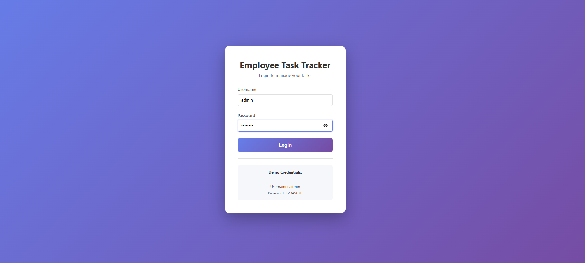
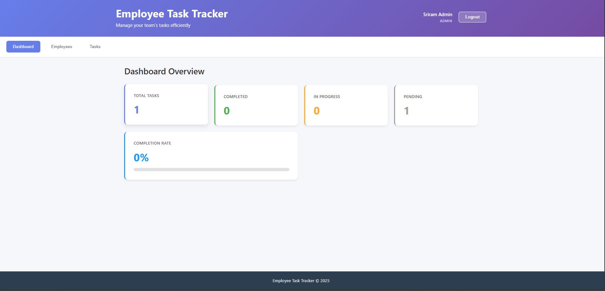
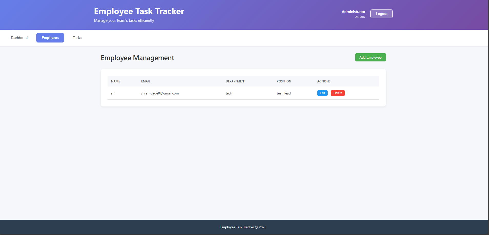
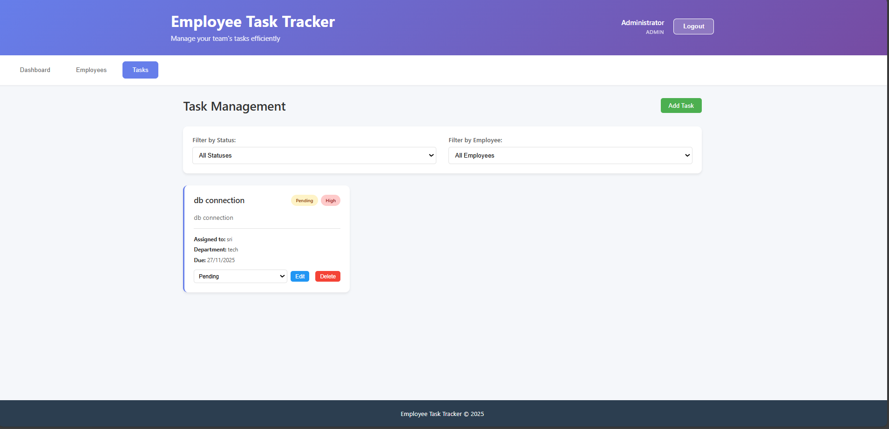
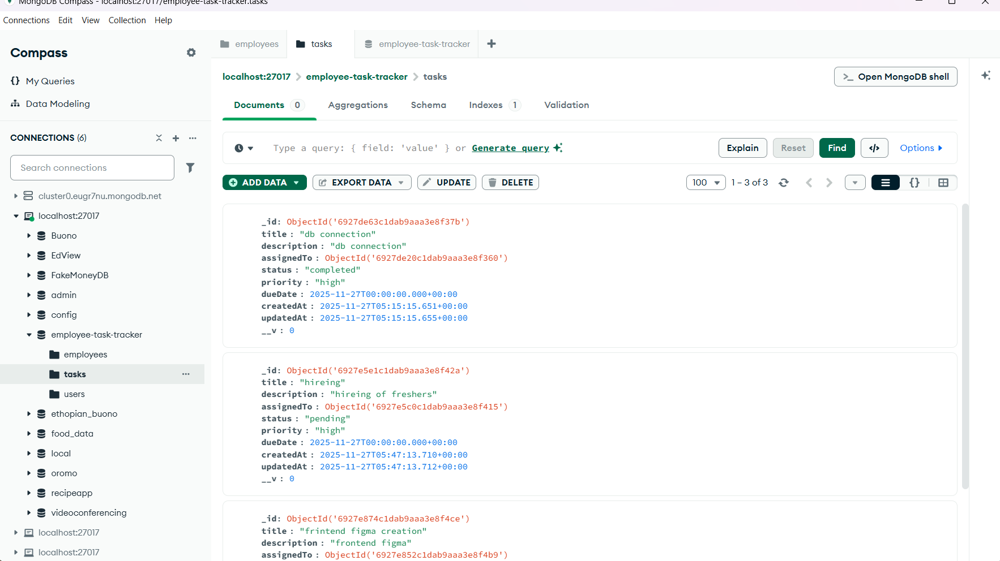

# Employee Task Tracker

A full-stack web application for managing employees and their tasks within a company. Built with React.js frontend, Node.js/Express backend with MVC architecture, JWT authentication, and MongoDB database.

## Demo Video

Watch a complete walkthrough of the Employee Task Tracker application:

https://user-images.githubusercontent.com/your-video-link/demo.mp4

*Alternatively, you can upload your demo video to YouTube and add the link here:*

[](https://www.youtube.com/watch?v=YOUR_VIDEO_ID)

## Screenshots

### Login Page


### Dashboard


### Employee Management


### Task Management


### Demo Video


### Mongodb 


### Mongodb tasks



## Features

- **Authentication System**: Secure JWT-based login with admin and user roles
- **Dashboard**: View key statistics including total tasks, completion rate, and task status breakdown
- **Employee Management**: Add, update, delete, and view all employees
- **Task Management**: Create and manage tasks with:
  - Task assignment to employees
  - Status tracking (Pending, In Progress, Completed)
  - Priority levels (Low, Medium, High)
  - Due date management
  - Filter tasks by status or employee
- **Responsive Design**: Works seamlessly on desktop and mobile devices
- **Secure API**: Protected routes with JWT authentication middleware

## Technology Stack

### Frontend
- React.js 18.2.0
- Axios for API calls with interceptors
- JWT token management
- Modern CSS with responsive design

### Backend
- Node.js with Express.js 4.18.2
- MVC Architecture (Models, Controllers, Routes)
- JWT Authentication (jsonwebtoken)
- Password Hashing (bcryptjs)
- Mongoose 8.0.0 (MongoDB ODM)
- Environment variables (dotenv)
- CORS enabled for cross-origin requests

### Database
- MongoDB

## Backend Architecture

The backend follows a clean MVC (Model-View-Controller) architecture:

```
backend/
├── config/
│   ├── config.js           # Application configuration
│   └── database.js         # MongoDB connection setup
├── controllers/
│   ├── authController.js   # Authentication logic
│   ├── employeeController.js
│   └── taskController.js
├── middlewares/
│   ├── auth.js             # JWT authentication & authorization
│   └── errorHandler.js     # Global error handling
├── models/
│   ├── User.js             # User model with auth methods
│   ├── Employee.js
│   └── Task.js
├── routes/
│   ├── auth.js             # Auth routes (login, register)
│   ├── employees.js
│   └── tasks.js
├── utils/
│   └── seedAdmin.js        # Admin user seeder
├── .env                    # Environment variables
├── server.js               # Application entry point
└── package.json
```

## Frontend Structure

```
frontend/
├── public/
│   └── index.html
├── src/
│   ├── components/
│   │   ├── Login.js/.css          # Login page
│   │   ├── Dashboard.js/.css       # Statistics dashboard
│   │   ├── EmployeeManagement.js/.css
│   │   └── TaskManagement.js/.css
│   ├── services/
│   │   └── api.js                  # API service with interceptors
│   ├── App.js/.css                 # Main app with auth state
│   ├── index.js/.css
│   └── index.js
└── package.json
```

## Prerequisites

Before running this application, make sure you have the following installed:

- Node.js (v14 or higher)
- npm (v6 or higher)
- MongoDB (running on localhost:27017)

## Installation

### 1. Clone or download the project

```bash
cd PROU
```

### 2. Set up MongoDB

Make sure MongoDB is installed and running on your system:

```bash
# Start MongoDB (the command may vary based on your OS)
# Windows:
net start MongoDB

# macOS (using Homebrew):
brew services start mongodb-community

# Linux:
sudo systemctl start mongod
```

The application will connect to `mongodb://localhost:27017/employee-task-tracker`

### 3. Install Backend Dependencies

```bash
cd backend
npm install
```

### 4. Create Admin User

Run the seed script to create the default admin user:

```bash
npm run seed:admin
```

This will create an admin account with:
- **Username**: admin
- **Password**: 12345670
- **Role**: admin

### 5. Install Frontend Dependencies

```bash
cd ../frontend
npm install
```

## Running the Application

You'll need to run both the backend and frontend servers simultaneously.

### Start the Backend Server

Open a terminal and run:

```bash
cd backend
npm start
```

The backend server will start on `http://localhost:5000`

You should see:
```
Server is running on port 5000
Environment: development
MongoDB Connected: localhost
```

### Start the Frontend Server

Open another terminal and run:

```bash
cd frontend
npm start
```

The frontend development server will start on `http://localhost:3000` and should automatically open in your browser.

## Quick Start (Windows)

Use the provided batch scripts:

1. Double-click `start-backend.bat` to start the backend (port 5000)
2. Double-click `start-frontend.bat` to start the frontend (port 3000)

## Using the Application

### 1. Login
- Open http://localhost:3000
- Enter credentials:
  - **Username**: admin
  - **Password**: 12345670
- Click "Login"

### 2. Add Employees
- Navigate to the "Employees" tab
- Click "Add Employee"
- Fill in the employee details (name, email, department, position)
- Click "Create"

### 3. Create Tasks
- Navigate to the "Tasks" tab
- Click "Add Task"
- Fill in task details:
  - Title
  - Description
  - Assign to an employee
  - Set status (Pending, In Progress, Completed)
  - Set priority (Low, Medium, High)
  - Set due date
- Click "Create"

### 4. Manage Tasks
- Update task status using the dropdown in each task card
- Edit task details using the "Edit" button
- Delete tasks using the "Delete" button
- Filter tasks by status or employee using the filters at the top

### 5. View Dashboard
- Navigate to the "Dashboard" tab
- View statistics:
  - Total number of tasks
  - Number of completed tasks
  - Number of in-progress tasks
  - Number of pending tasks
  - Overall completion rate

### 6. Logout
- Click the "Logout" button in the header to end your session

## API Endpoints

### Authentication Endpoints
- `POST /api/auth/login` - Login user
- `GET /api/auth/me` - Get current user (Protected)
- `POST /api/auth/register` - Register new user (Admin only)
- `GET /api/auth/users` - Get all users (Admin only)

### Employee Endpoints (All Protected)
- `GET /api/employees` - Get all employees
- `GET /api/employees/:id` - Get single employee
- `POST /api/employees` - Create new employee
- `PUT /api/employees/:id` - Update employee
- `DELETE /api/employees/:id` - Delete employee

### Task Endpoints (All Protected)
- `GET /api/tasks` - Get all tasks (supports ?status=value&employeeId=value filters)
- `GET /api/tasks/:id` - Get single task
- `POST /api/tasks` - Create new task
- `PUT /api/tasks/:id` - Update task
- `DELETE /api/tasks/:id` - Delete task
- `GET /api/tasks/stats/dashboard` - Get dashboard statistics

### Health Check
- `GET /api/health` - Check if server is running

## Authentication

The application uses JWT (JSON Web Tokens) for authentication:

1. User logs in with username and password
2. Server validates credentials and returns a JWT token
3. Frontend stores token in localStorage
4. Token is automatically sent with every API request via Authorization header
5. Backend middleware validates token before processing protected routes
6. Invalid or expired tokens automatically redirect to login page

## Environment Variables

Backend `.env` file configuration:

```env
PORT=5000
MONGODB_URI=mongodb://localhost:27017/employee-task-tracker
JWT_SECRET=your_jwt_secret_key_change_this_in_production_2025
JWT_EXPIRE=7d
NODE_ENV=development
```

## Development

### Backend Development Mode

For automatic server restart on file changes:

```bash
cd backend
npm run dev
```

### Frontend Development Mode

The React development server already has hot-reloading enabled, so changes will reflect automatically.

## Project Scripts

### Backend
- `npm start` - Start the server
- `npm run dev` - Start server with nodemon (auto-restart)
- `npm run seed:admin` - Create admin user

### Frontend
- `npm start` - Start development server
- `npm run build` - Build for production
- `npm test` - Run tests

## Troubleshooting

### MongoDB Connection Issues
- Ensure MongoDB is running: `mongod --version`
- Check if MongoDB is accessible at `localhost:27017`
- Verify no firewall is blocking the connection

### Port Already in Use
If port 5000 or 3000 is already in use:

**Backend**: Edit `backend/.env` and change the PORT variable:
```env
PORT=5001
```

**Frontend**: Create a `.env` file in the frontend directory:
```env
PORT=3001
```

### CORS Errors
Make sure the backend server is running and CORS is properly configured in `backend/server.js`

### Authentication Issues
- Clear browser localStorage and try logging in again
- Ensure JWT_SECRET is set in backend/.env
- Check if token is being sent in request headers

### "Admin already exists" when seeding
This is normal if you've already run the seed script. The admin user has already been created.

## Security Features

- Password hashing using bcryptjs
- JWT token-based authentication
- Protected API routes
- Role-based authorization (admin/user)
- Token expiration (7 days default)
- Automatic logout on invalid/expired tokens
- CORS configuration

## Future Enhancements

- Email notifications for task assignments
- File attachments for tasks
- Task comments and activity log
- Advanced reporting and analytics
- Export data to CSV/PDF
- Real-time updates using WebSockets
- Two-factor authentication
- Password reset functionality
- User profile management
- Task reminders and notifications

## License

This project is open source and available for educational purposes.

## Support

For issues or questions, please check the console logs in both the browser (F12) and backend terminal for error messages.

---

**Default Admin Credentials:**
- Username: `admin`
- Password: `12345670`

**Important**: Change these credentials in production!
